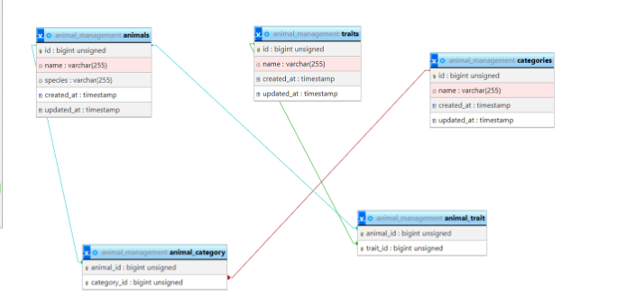


**Gestionarea Animalelor - Proiect Laravel cu Vite**

**1. Proiectarea Aplicației**

**Arhitectura MVC**

Aplicația va utiliza arhitectura MVC (Model-View-Controller), care va include următoarele componente:

- **Modele**: Animal, Category
- **Controler**: AnimalController
- **Vizualizări**: index.blade.php, create.blade.php, edit.blade.php

**Schema Bazei de Date**

**Screen la sfirsit**

**2. Crearea Proiectului și Configurarea Mediului**

**Crearea Proiectului Laravel**

composer create-project --prefer-dist laravel/laravel gestionarea-animalelor

cd gestionarea-animalelor

**Instalarea Vite pentru Frontend**

npm create vite@latest

npm install

npm run dev

**3. Migrarea Bazei de Date**

**Crearea Migrațiilor**

Creează migrațiile pentru tabelele categories și animals.

**Migrarea pentru tabelul categories:**

public function up()

{

`    `Schema::create('categories', function (Blueprint $table) {

`        `$table->id();

`        `$table->string('name');

`        `$table->timestamps();

`    `});

}

**Migrarea pentru tabelul animals:**

public function up()

{

`    `Schema::create('animals', function (Blueprint $table) {

`        `$table->id();

`        `$table->string('name');

`        `$table->integer('age');

`        `$table->foreignId('category\_id')->constrained('categories')->onDelete('cascade');

`        `$table->timestamps();

`    `});

}

**4. Crearea Modelelor**

**Modelul Category**

// app/Models/Category.php

namespace App\Models;

use Illuminate\Database\Eloquent\Factories\HasFactory;

use Illuminate\Database\Eloquent\Model;

class Category extends Model

{

`    `use HasFactory;

`    `protected $fillable = ['name'];

`    `public function animals()

`    `{

`        `return $this->hasMany(Animal::class);

`    `}

}

**Modelul Animal**

// app/Models/Animal.php

namespace App\Models;

use Illuminate\Database\Eloquent\Factories\HasFactory;

use Illuminate\Database\Eloquent\Model;

class Animal extends Model

{

`    `use HasFactory;

`    `protected $fillable = ['name', 'age', 'category\_id'];

`    `public function category()

`    `{

`        `return $this->belongsTo(Category::class);

`    `}

}

**5. Crearea Controlerelor**

**AnimalController pentru Operațiile CRUD**

Codul pentru controlerul AnimalController:

// app/Http/Controllers/AnimalController.php

namespace App\Http\Controllers;

use App\Models\Animal;

use App\Models\Category;

use Illuminate\Http\Request;

class AnimalController extends Controller

{

`    `public function index()

`    `{

`        `$animals = Animal::with('category')->get();

`        `return view('animals.index', compact('animals'));

`    `}

`    `public function create()

`    `{

`        `$categories = Category::all();

`        `return view('animals.create', compact('categories'));

`    `}

`    `public function store(Request $request)

`    `{

`        `$request->validate([

`            `'name' => 'required|string|max:255',

`            `'age' => 'required|integer',

`            `'category\_id' => 'required|exists:categories,id',

`        `]);

`        `Animal::create($request->all());

`        `return redirect()->route('animals.index');

`    `}

`    `public function edit(Animal $animal)

`    `{

`        `$categories = Category::all();

`        `return view('animals.edit', compact('animal', 'categories'));

`    `}

`    `public function update(Request $request, Animal $animal)

`    `{

`        `$request->validate([

`            `'name' => 'required|string|max:255',

`            `'age' => 'required|integer',

`            `'category\_id' => 'required|exists:categories,id',

`        `]);

`        `$animal->update($request->all());

`        `return redirect()->route('animals.index');

`    `}

`    `public function destroy(Animal $animal)

`    `{

`        `$animal->delete();

`        `return redirect()->route('animals.index');

`    `}

}

**6. Configurarea Rutelor**

// routes/web.php

use App\Http\Controllers\AnimalController;

Route::resource('animals', AnimalController::class);

**7. Crearea Vizualizărilor**

**Vizualizarea index.blade.php**

<!-- resources/views/animals/index.blade.php -->

<h1>Lista Animalelor</h1>

<a href="{{ route('animals.create') }}">Adaugă Animal</a>

<table>

`    `<tr>

`        `<th>Nume</th>

`        `<th>Vârstă</th>

`        `<th>Categorie</th>

`        `<th>Acțiuni</th>

`    `</tr>

`    `@foreach($animals as $animal)

`        `<tr>

`            `<td>{{ $animal->name }}</td>

`            `<td>{{ $animal->age }}</td>

`            `<td>{{ $animal->category->name }}</td>

`            `<td>

`                `<a href="{{ route('animals.edit', $animal) }}">Editează</a>

`                `<form action="{{ route('animals.destroy', $animal) }}" method="POST">

`                    `@csrf

`                    `@method('DELETE')

`                    `<button type="submit">Șterge</button>

`                `</form>

`            `</td>

`        `</tr>

`    `@endforeach

</table>

**Vizualizarea create.blade.php**

<!-- resources/views/animals/create.blade.php -->

<h1>Adaugă Animal</h1>

<form action="{{ route('animals.store') }}" method="POST">

`    `@csrf

`    `<label for="name">Nume:</label>

`    `<input type="text" name="name" id="name" required>

`    `<label for="age">Vârstă:</label>

`    `<input type="number" name="age" id="age" required>

`    `<label for="category\_id">Categorie:</label>

`    `<select name="category\_id" id="category\_id" required>

`        `@foreach($categories as $category)

`            `<option value="{{ $category->id }}">{{ $category->name }}</option>

`        `@endforeach

`    `</select>

`    `<button type="submit">Salvează</button>

</form>

**Vizualizarea edit.blade.php**

<!-- resources/views/animals/edit.blade.php -->

<h1>Editează Animal</h1>

<form action="{{ route('animals.update', $animal) }}" method="POST">

`    `@csrf

`    `@method('PUT')

`    `<label for="name">Nume:</label>

`    `<input type="text" name="name" id="name" value="{{ $animal->name }}" required>

`    `<label for="age">Vârstă:</label>

`    `<input type="number" name="age" id="age" value="{{ $animal->age }}" required>

`    `<label for="category\_id">Categorie:</label>

`    `<select name="category\_id" id="category\_id" required>

`        `@foreach($categories as $category)

`            `<option value="{{ $category->id }}" {{ $category->id == $animal->category\_id ? 'selected' : '' }}>

`                `{{ $category->name }}

`            `</option>

`        `@endforeach

`    `</select>

`    `<button type="submit">Actualizează</button>

</form>

**8. Generarea Datelor de Test**

// database/factories/AnimalFactory.php

use App\Models\Animal;

use App\Models\Category;

use Faker\Generator as Faker;

$factory->define(Animal::class, function (Faker $faker) {

`    `return [

`        `'name' => $faker->name,

`        `'age' => $faker->numberBetween(1, 10),

`        `'category\_id' => Category::inRandomOrder()->first()->id,

`    `];

});

-----

